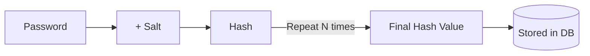

Parent: [[05.SE/GEMINI.MD]]

# 1. 단방향 해시 함수의 개요 및 특징

## 가. 정의
- 임의의 길이를 가진 데이터를 입력받아 고정된 길이의 비트열(해시값)을 출력하는 함수
- 입력값의 아주 작은 변화도 출력값의 큰 변화(**쇄도 효과, Avalanche Effect**)를 일으킴

## 나. 주요 특징 [두음: 압효단충]
1.  **압축성 (Compression)**: 입력을 고정된 크기의 출력으로 변환
2.  **효율성 (Efficiency)**: 해시값 계산이 신속하게 수행됨
3.  **단방향성 (One-wayness)**: 해시값으로부터 원래의 입력값을 역산하기 불가능함 (역상 저항성)
4.  **충돌 저항성 (Collision Resistance)**: 동일한 해시값을 갖는 서로 다른 두 입력값을 찾기 어려움

# 2. 단방향 해시 함수의 문제점과 공격 기법

## 가. 단방향 해시 함수의 문제점
1.  **무차별 대입 공격 (Brute-force Attack)**: 해시 함수는 속도가 빠르기 때문에, 공격자는 초당 수십억 번의 대입을 통해 원래의 비밀번호를 찾아낼 수 있음
2.  **동일 패스워드 동일 해시값**: 같은 비밀번호를 사용하는 이용자들은 해시값도 동일하여, 한 명의 패스워드가 노출되면 다른 이용자들도 위험함

## 나. 레인보우 테이블 (Rainbow Table)
- **개념**: 해시 함수를 사용하여 만들어낼 수 있는 모든 해시값들을 미리 계산하여 역산 가능한 형태로 저장한 표
- **특징**: 무차별 대입 공격의 시간 소요를 줄이기 위해 **공간(Space)과 시간(Time)을 트레이드오프**한 공격 방식
- **공격 방식**: 저장된 해시값을 검색하여 평문을 즉시 찾아냄

# 3. 해시 보안 강화 기법: 솔트(Salt)와 키 스트레칭(Key Stretching)

| 기법 | 개념 및 동작 방식 | 효과 |
|---|---|---|
| **해시 솔트 (Hash Salt)** | 평문 패스워드에 임의의 문자열(**Salt**)을 추가하여 해싱함 | 레인보우 테이블 공격 무력화, 동일 패스워드라도 다른 해시값 생성 |
| **키 스트레칭 (Key Stretching)** | 해시 함수를 수천~수만 번 **반복(Iteration)** 수행함 | 무차별 대입 공격의 시간 비용 증가 (속도 지연) |

## 가. 보안 강화 프로세스 도식화

# 4. 해시 함수의 주요 활용 분야

1.  **무결성 검증 (Integrity)**: 메시지나 파일의 변조 여부 확인 (예: MD5, SHA-256)
2.  **패스워드 저장**: 평문을 저장하지 않고 해시값만 저장하여 유출 시 피해 최소화
3.  **디지털 서명 (Digital Signature)**: 메시지 축약(Digest)을 통해 서명 및 검증 효율화
4.  **전자봉투 (Digital Envelope)**: 메시지의 무결성 및 출처 인증에 활용
5.  **블록체인 (Blockchain)**: 블록의 연결 구조 형성 및 작업 증명(PoW) 메커니즘의 핵심 기술

# 5. 기술사적 제언

## 가. 알고리즘 선택 가이드
- MD5, SHA-1은 충돌 발생 가능성으로 인해 더 이상 안전하지 않음
- 최신 표준인 **SHA-256/384/512** 또는 **SHA-3** 사용 권장

## 나. 패스워드 저장 표준 (Key Derivation Functions)
- 단순 해싱 대신 **Argon2, bcrypt, scrypt, PBKDF2**와 같은 검증된 알고리즘을 사용하여 솔팅과 스트레칭을 기본 적용해야 함

> [!tip] **기술사 인사이트**
> 해시 함수는 보안의 기본이면서도 가장 강력한 도구입니다. 최근에는 양자 컴퓨터의 발전에 따른 해시 함수 영향도를 고려하여 **양자 내성 암호(PQC)** 연구와 함께 해시 길이를 늘리는 등의 대응 전략이 필요합니다.

## Related Notes
- [[002.SE_암호_메커니즘.md]]
- [[007.SE_HMAC_메시지_인증.md]]
- [[011.SE_양자내성암호_PQC.md]]
