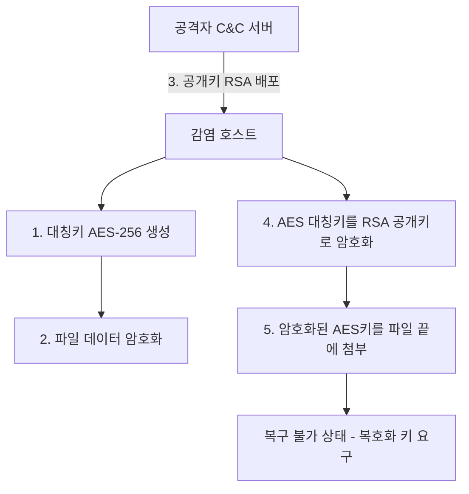

Parent: [[05.SE/GEMINI.MD]]

# 1. 랜섬웨어 및 RaaS의 개요

## 가. 정의
- **랜섬웨어 (Ransomware)**: 사용자의 데이터를 암호화하거나 시스템을 잠근 후, 이를 인질로 삼아 금전(Ransom)을 요구하는 악성 소프트웨어
- **RaaS (Ransomware as a Service)**: 공격 도구를 제작할 기술이 없는 범죄자도 일정 비용이나 수익 배분을 통해 랜섬웨어를 유포할 수 있게 해주는 **서비스형 비즈니스 모델**

## 나. 등장 배경 및 특징
- **추적의 어려움**: 비트코인 등 가상자산을 활용한 자금 세탁으로 추적 회피
- **이중 협박 (Double Extortion)**: 데이터 암호화뿐만 아니라 다크웹 유출 협박 병행
- **분업화/전문화**: 개발자(RaaS 운영)와 유포자(Affiliate)의 역할 분담으로 공격 가속화

# 2. 랜섬웨어와 RaaS의 비교

| 비교 항목 | 랜섬웨어 (Ransomware) | RaaS (Ransomware as a Service) |
|---|---|---|
| **핵심 성격** | 악성코드(Malware) 그 자체 | 비즈니스 모델 (Platform) |
| **운영 주체** | 해커 개인 또는 조직 | 개발자(Operator) + 유포자(Affiliate) |
| **진입 장벽** | 높음 (암호화 및 유포 기술 필요) | 낮음 (플랫폼 가입 및 구독 시 가능) |
| **수익 구조** | 단일 공격자가 전액 획득 | 개발자와 유포자가 수익 쉐어 (보통 2:8~3:7) |
| **주요 사례** | WannaCry, Petya | LockBit, Conti, REvil |

# 3. 주요 감염 경로 및 암호화 동작 원리

## 가. 주요 감염 경로
1.  **사회공학적 기법**: 피싱 메일(첨부파일, 링크 클릭 유도)
2.  **보안 취약점 악용**: 패치되지 않은 소프트웨어(Web, Java 등) 취약점
3.  **원격 접속 공격**: 관리되지 않는 RDP(Remote Desktop Protocol) 포트 무차별 대입
4.  **공급망 공격**: 정상 소프트웨어 업데이트 서버 해킹을 통한 배포

## 나. 하이브리드 암호화 동작 원리
공격자는 속도와 보안성을 모두 확보하기 위해 대칭키와 공개키를 혼합한 **하이브리드 암호화** 방식을 주로 사용합니다.

# 4. 피해 예방 및 침해 사고 대응 절차

## 가. 피해 예방 방안 (Prevention)
1.  **3-2-1 백업 원칙**: 3개 이상의 복사본, 2개 이상의 매체, 1개 이상의 오프라인(망분리) 보관
2.  **보안 패치 및 업데이트**: OS 및 주요 애플리케이션의 최신 보안 패치 상시 적용
3.  **엔드포인트 보안 (EDR/XDR)**: 실시간 이상 행위 탐지 및 파일 암호화 시도 차단
4.  **사용자 교육**: 모르는 발신인의 메일 첨부파일 실행 금지 교육

## 나. 침해 사고 발생 시 대응 절차 (Response)
| 단계 | 대응 활동 | 상세 내용 |
|---|---|---|
| **1. 격리 (Isolation)** | 네트워크 차단 | 추가 확산을 막기 위해 감염 장비의 유/무선 네트워크 즉각 차단 |
| **2. 식별 (Identification)** | 랜섬웨어 종류 파악 | 확장자, 랜섬노트(Ransom Note)를 통해 공격자 그룹 및 종류 식별 |
| **3. 제거 (Eradication)** | 악성코드 제거 | 백신 등을 활용하여 잔존 악성코드 및 백도어 제거 |
| **4. 복구 (Recovery)** | 데이터 복구 | 오프라인 백업본을 통한 복원 (공격자와의 협상은 가급적 지양) |
| **5. 사후 관리 (Lessons Learned)** | 원인 분석 | 유입 경로 분석 및 재발 방지를 위한 보안 정책 강화 |

# 5. 기술사적 제언

## 가. 제로 트러스트(Zero Trust)의 도입
- "신뢰하되 검증하라"가 아닌 **"절대 신뢰하지 말고 항상 검증하라"**는 원칙에 따라 내부망 내의 측면 이동(Lateral Movement)을 철저히 차단해야 함

## 나. 사이버 복원력(Cyber Resilience) 확보
- 100% 방어는 불가능함을 인정하고, 공격을 당하더라도 **신속하게 서비스를 재개**할 수 있는 BCP(비즈니스 연속성 계획) 관점의 아키텍처 설계가 필수적임

> [!tip] **기술사 인사이트**
> 랜섬웨어 대응의 핵심은 **'백업의 무결성'**과 **'최소 권한의 원칙'**입니다. 최근 공격자들은 백업 서버부터 파괴하는 전략을 취하므로, 물리적으로 분리된 **Air-gapped 백업**과 권한 오남용을 막기 위한 **IAM(Identity & Access Management)** 고도화가 고득점 포인트입니다.

## Related Notes
- [[028.공격_표면_및_측면_이동(Lateral_Movement).md]]
- [[011.MG_BCP.md]]
- [[004.SE_제로_트러스트.md]]
- [[020.Cyber_Resilience.md]]
