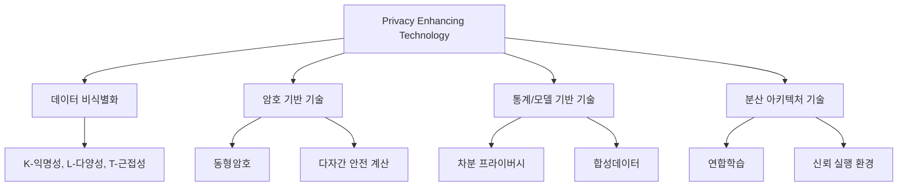

Parent: [[05.SE/GEMINI.MD]]

# 1. 개인정보 보호 강화기술 (PET)의 개요 및 배경

## 가. 정의
- 개인정보의 수집, 저장, 활용, 파기 전 과정에서 **프라이버시 노출 위험을 최소화**하면서도 **데이터의 통계적 가치와 활용성을 극대화**하는 기술적 수단 및 아키텍처
- "Privacy by Design" 원칙을 실현하기 위한 핵심 기술적 구현체

## 나. 등장 배경 및 필요성
1.  **데이터 경제 가속화**: AI 학습 및 빅데이터 분석을 위한 양질의 데이터 수요 급증
2.  **규제 강화 (Compliance)**: GDPR, 개인정보 보호법 등 전 세계적인 프라이버시 규제 강화
3.  **프라이버시-활용성 트레이드오프**: 데이터 가명·익명화 시 발생하는 정보 손실과 재식별 위험 사이의 균형 확보 필요
4.  **보안 사고 위협**: 대규모 데이터 유출 사고로 인한 기업의 법적·윤리적 책임 증대

# 2. PET의 주요 기술 분류 및 핵심 기술

## 가. PET 기술 분류 체계

## 나. 핵심 구성 요소 및 설명
| 분류 | 핵심 기술 | 주요 특징 |
|---|---|---|
| **데이터 비식별** | **가명·익명화** | 삭제, 마스킹, 범주화 등을 통해 개인 식별 인자 제거 |
| **암호 기반** | **동형암호 (HE)** | 데이터를 암호화한 상태에서 복호화 없이 연산 수행 |
| **통계 기반** | **차분 프라이버시 (DP)** | 데이터에 수학적 노이즈를 추가하여 개별 식별 방지 |
| **생성 기반** | **합성데이터 (SD)** | 실제 데이터의 통계적 특성을 반영한 가상 데이터 생성 |
| **분산 기반** | **연합학습 (FL)** | 로컬에서 학습 후 모델 파라미터만 공유 (데이터 이동 없음) |

# 3. 주요 PET 기술 (동형암호, 차분 프라이버시, 합성데이터) 비교

| 비교 항목 | 동형암호 (HE) | 차분 프라이버시 (DP) | 합성데이터 (SD) |
|---|---|---|---|
| **핵심 매커니즘** | 복호화 없는 암호문 연산 | 데이터셋에 노이즈 주입 | GAN/VAE 기반 가상 생성 |
| **프라이버시 보호** | 매우 높음 (수학적 증명) | 높음 (확률적 보장) | 높음 (실제 값 미존재) |
| **데이터 활용성** | **원본과 동일** (정확도 유지) | 노이즈로 인한 정확도 손실 | 통계적 유사성만 유지 |
| **연산 성능** | 낮음 (높은 컴퓨팅 파워) | 높음 (연산 오버헤드 적음) | 높음 (학습 후 생성 속도 빠름) |
| **주요 한계** | 성능 병목, 알고리즘 제약 | 개인정보 누출 지수(Budget) 관리 | 실제 데이터와의 정밀도 격차 |
| **활용 사례** | 의료 데이터 위탁 분석 | 인구 통계, 센서 데이터 | AI 학습용 데이터셋 구축 |

# 4. 기술사적 제언 및 실무 적용 방안

## 가. 기술적 연계 방안 (Multi-PETs)
- 단일 기술 적용의 한계를 극복하기 위해 **차분 프라이버시가 적용된 연합학습**이나 **동형암호를 통한 다자간 계산** 등 복합 모델링 적용 권고

## 나. 실무 도입 시 고려사항
1.  **데이터 효용성(Utility)**: 비즈니스 목적에 부합하는 최소한의 정확도 확보 여부 검토
2.  **보안 성숙도**: 기술 도입에 따른 오버헤드와 인프라 비용 대비 효과 분석(TCO 관점)
3.  **거버넌스**: PET 적용 결과에 대한 재식별 위험성 평가 및 적정성 평가 절차 수립

> [!tip] **기술사 인사이트**
> PET는 단순히 '데이터를 숨기는 기술'이 아니라 **'데이터 활용의 명분'**을 제공하는 기술입니다. 향후 **생성형 AI의 학습 데이터 저작권 및 프라이버시 이슈**를 해결할 수 있는 핵심 도구로서 **합성데이터**와 **차분 프라이버시**의 역할이 더욱 강조될 것입니다.

## Related Notes
- [[075.MG_데이터_경제.md]]
- [[015.SE_FPE_및_OPE_데이터_암호_보호.md]]
- [[005.Generative_AI_User_Protection_Guideline_2025.md]]
- [[002.ISO_IEC_42001_2023.md]] (AI 경영시스템)
