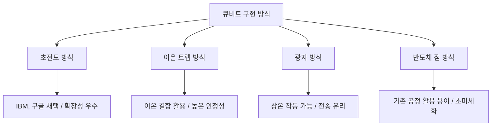

# [001].CA_양자컴퓨팅_아키텍처_및_구현_메커니즘

## 1. [도입: Why] 양자 컴퓨팅의 개요

### 가. 정의
- 양자 비트(Qubit)의 중첩과 얽힘 현상을 이용하여 지수 함수적 병렬 처리를 수행하는 새로운 패러다임의 컴퓨팅 기술

### 나. 등장 배경 및 필요성
1. **복잡한 문제 해결**: 고전 컴퓨터로 수만 년 걸리는 소인수분해, 대규모 시뮬레이션을 수 초~수 분 내 해결 가능
2. **최적화 문제**: 금융 포트폴리오 최적화, 물류 경로 최적화 등 대규모 변수가 포함된 문제의 실시간 처리 필요

## 2. [핵심: What & How] 양자 컴퓨터의 아키텍처 및 구현 방식

### 가. 양자 컴퓨터 구성 요소
| 계층 | 구성 요소 | 상세 역할 |
|---|---|---|
| **소프트웨어** | **양자 알고리즘** | 쇼어 알고리즘(Shor's), 그로버 알고리즘(Grover's) 등 |
| | **컴파일러** | 고수준 언어를 양자 게이트 연산으로 변환 |
| **시스템 아키텍처** | **마이크로 아키텍처** | 연산 제어 및 데이터 흐름 관리 |
| | **양자 오류 수정 (QEC)** | 결잃음에 따른 노이즈 복원 (표면 코드 등) |
| **하드웨어** | **제어/관측 기기** | 극저온 유지 및 양자 상태 측정 |
| | **양자 비트 (Qubit)** | 초전도, 이온 트랩 등 물리적 구현 매체 |

### 나. 큐비트 구현 방법 비교 (Mermaid)

## 3. [심화: Deep-dive] 양자 어닐링 (Quantum Annealing)

### 가. 메커니즘 및 특징
- **정의**: 복잡한 조합 최적화 문제에서 에너지가 가장 낮은 최적 상태를 찾기 위해 양자 터널링 효과를 이용하는 특수 목적형 양자 컴퓨팅
- **구동 원리**: **니오븀 링**에 흐르는 전류 방향을 통해 0과 1을 정의하고, **절대 영도** 상태에서 최적해 탐색

### 나. 양자 어닐링 수행 절차
1. **중첩 상태 생성**: 모든 가능한 상태가 공존하도록 초기화
2. **횡 자기장 방사**: 시스템에 초기 에너지를 주입
3. **자기장 조절**: 점진적으로 에너지를 낮추어 바닥 상태(최적해) 유도
4. **상태 관측**: 최종 양자 상태를 측정하여 최적의 솔루션 획득

## 4. [결론: Effect & Insight] 기술사적 제언

### 가. 기술적 도전 과제: NISQ 시대의 대응
- 현재는 **NISQ(Noisy Intermediate-Scale Quantum)** 시대로, 오류가 포함된 중간 규모 양자 기기를 활용 중
- 대규모 범용 양자 컴퓨터(FTQC; Fault-Tolerant Quantum Computer)로 가기 위한 **양자 오류 정정(QEC)** 기술 확보가 관건임

### 나. 향후 전망 및 제언
- 양자 컴퓨팅은 기존 고전 컴퓨터를 대체하는 것이 아니라, 고전 컴퓨터로 처리가 어려운 난제를 해결하는 **Quantum Accelerator**로서 하이브리드 형태로 발전할 것으로 전망됨

## 5. 검증 체크리스트 (PE-Audit)

| # | 검증 항목 | 기준 | 판정 |
|---|---|---|---|
| 1 | **최신성·정확성** | 초전도/이온트랩 등 구현 방식 및 어닐링 반영 | ✅ |
| 2 | **키워드 적정성** | QEC, NISQ, 쇼어 알고리즘, 니오븀 링 등 배치 | ✅ |
| 3 | **시각화 품질** | 큐비트 구현 방식을 계층 구조로 명확히 표현 | ✅ |
| 4 | **논리적 일관성** | 아키텍처 계층 구조에서 하드웨어 구현까지 연결 | ✅ |
| 5 | **차별화 요소** | FTQC로의 이행 및 가속기로서의 역할 제언 | ✅ |
