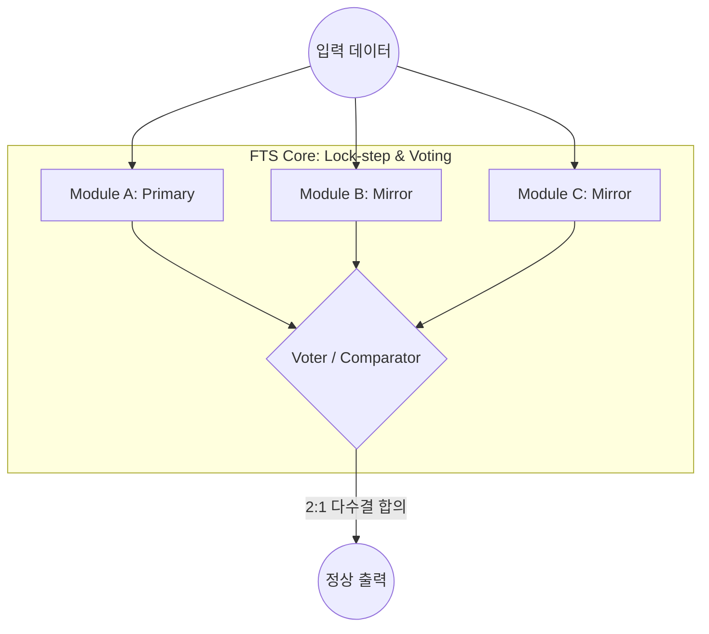

Parent: [[06.CA/GEMINI.MD]]

# 1. 가용성 보장 기술의 개요

## 가. 정의
- 시스템의 장애 발생 시에도 중단 없이 서비스를 제공하거나, 장애 복구 시간을 최소화하여 서비스 가능 상태를 유지하는 기술
- **가용성(Availability) = MTBF / (MTBF + MTTR)** 식을 통해 정량화하며, 주로 **99.999%(Five Nines)** 달성을 목표로 함

## 나. 핵심 메커니즘: 중복성 (Redundancy)
- 단일 장애 지점(**SPOF**, Single Point of Failure)을 제거하기 위해 하드웨어, 소프트웨어, 네트워크 등 모든 계층에 예비 자원을 배치

# 2. FTS와 HA의 구현 방법 및 도식

## 가. FTS (Fault Tolerant System) 구현 방법
- **개념**: 장애가 발생해도 서비스 중단(Downtime)이 **전혀 없는** 무중단 시스템
- **주요 구현 기술**: Hardware Mirroring, Voting Mechanism (TMR), Hot Standby (Lock-step)
- **메커니즘 도식 (TMR 방식)**:


## 나. HA (High Availability) 구현 방법
- **개념**: 장애 발생 시 신속하게 예비 시스템으로 전환하여 서비스 중단 시간을 **최소화**하는 시스템
- **주요 구현 기술**: Clustering (Failover), Heartbeat Monitoring, Shared Storage
- **메커니즘 도식 (Active-Standby 방식)**:
```mermaid
graph LR
    User[사용자] --> VIP(가상 IP: Virtual IP)

    subgraph "HA Cluster Group"
        VIP --> Active[Active Node]
        Active <--- "Heartbeat" ---> Standby[Standby Node]
        
        Active -- "1. 서비스 수행" --> Storage[(Shared Storage)]
        Standby -. "2. 장애 시 자원 Take-over" .-> Storage
    end

    Active -- "Fault!" --- X((X))
```

# 3. FTS와 HA의 비교 설명

| 비교 항목 | FTS (Fault Tolerant System) | HA (High Availability) |
|---|---|---|
| **목표** | **무중단 (Zero Downtime)** | **최소 중단 (Minimal Downtime)** |
| **장애 시 영향** | 서비스 연속 유지 (투명함) | 순간적인 서비스 지연 또는 재접속 필요 |
| **메커니즘** | 컴포넌트 단위의 완전 동기화 | 서버/인스턴스 단위의 전환(Failover) |
| **구현 비용** | **매우 높음** (전용 HW, 중복 투자) | 상대적으로 낮음 (범용 서버 활용 가능) |
| **주요 활용** | 금융 결제, 항공 관제, 원자력 제어 | 웹 서비스, 기업용 DB, 일반 업무 시스템 |

# 4. 가용성 향상을 위한 기술사적 제언

## 가. RTO/RPO 기반의 전략 수립
- 비즈니스 중요도에 따라 **RTO(복구 시간 목표)**가 0에 가까워야 한다면 FTS를, 수 초~수 분 이내라면 HA를 선택하는 최적화 전략 필요

## 나. 클라우드 네이티브 환경의 변화
- 클라우드의 **멀티 AZ(Availability Zone)** 배치와 **오토 스케일링(Auto Scaling)**을 통해 저비용으로 높은 가용성을 확보하는 추세

> [!tip] **기술사 인사이트**
> 가용성 설계의 핵심은 **'비용 대비 효익'**입니다. FTS는 기술적으로 완벽해 보이지만 과잉 투자가 될 수 있으므로, **SRE(Site Reliability Engineering)** 관점에서 허용 가능한 에러 예산(Error Budget) 내에서 HA와 FTS를 적절히 혼합 배치하는 아키텍처 역량이 중요합니다.

## Related Notes
- [[016.DRS.md]]
- [[022.RTO.md]]
- [[023.RPO.md]]
- [[001.SRE(Site Reliability Engineering).md]]
