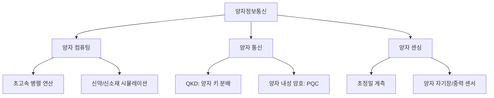

# [001].SV_양자정보통신_개요_및_발전전략

## 1. [도입: Why] 양자정보통신(Quantum Information Communication)의 개요

### 가. 정의
- 양자의 고유한 물리적 특성인 **중첩(Superposition)**, **얽힘(Entanglement)** 등을 활용하여 기존 정보통신의 한계를 극복하는 초고속 연산, 초신뢰 보안, 초정밀 계측 기술

### 나. 등장 배경 및 필요성
1. **무어의 법칙 한계**: 실리콘 기반 반도체 미세화 공정의 물리적 한계 도달에 따른 새로운 연산 패러다임 필요
2. **보안 위협 증대**: 양자 컴퓨터의 등장으로 기존 RSA 등 공개키 암호 체계 무력화 위협(양자 내성 암호 필요성)
3. **데이터 폭증**: 초거대 AI, 디지털 트윈 등 막대한 데이터 처리를 위한 초고속 병렬 연산 능력 요구

## 2. [핵심: What & How] 양자의 물리적 특성 및 3대 기술 영역

### 가. 양자의 4대 핵심 특성
| 특성 | 설명 | 비고 |
|---|---|---|
| **양자 중첩** | 0과 1의 상태가 동시에 존재할 수 있는 상태 | 병렬 연산의 근간 |
| **복제 불가** | 임의의 양자 상태를 완벽하게 복제할 수 없음 | 양자 암호의 보안성 원천 |
| **양자 얽힘** | 두 양자 간의 상관관계가 거리에 상관없이 유지됨 | 양자 순간이동, 원격 통신 |
| **결잃음 (Decoherence)** | 외부 상호작용으로 인해 양자 상태(결맞음)를 상실함 | 양자 오류의 주요 원인 |

### 나. 양자정보통신 3대 기술 영역 (Mermaid)

## 3. [심화: Deep-dive] 양자 정보의 최소 단위 및 임계점

### 가. 양자 비트 (Qubit)
- **개념**: 2개의 기저 상태가 중첩된 상태로 존재할 수 있는 양자 시스템의 최소 정보 단위
- **특징**: n개의 큐비트는 $2^n$개의 상태를 동시에 표현 가능하여 지수 함수적 연산 성능 제공

### 나. 양자 우월성 (Quantum Supremacy)
- **정의**: 양자 컴퓨터가 기존 최신 슈퍼컴퓨터의 연산 능력을 혁신적으로 뛰어넘어 특정 문제를 해결하는 상태
- **현재 단계**: 구글(Sycamore), IBM(Osprey/Condor) 등이 수백~수천 큐비트급 하드웨어 개발을 통해 실증 중

## 4. [결론: Effect & Insight] 국가 양자기술 발전 전략

### 가. 4대 중점 추진 전략
1. **원천 연구 강화**: 풀 스택 양자 컴퓨터 개발 및 양자 통신망 고도화 투자
2. **생태계 구축**: 양자 전문 인력 육성 및 산·학·연 협력 거버넌스 강화
3. **인프라 확충**: 양자 전용 팹(Fab) 설치 및 가상머신(VM) 환경 제공
4. **산업 확산**: 국방, 의료, 금융 분야 시범 사업을 통한 조기 상용화 유도

### 나. 기술사적 제언
- 양자기술은 국가 안보 및 미래 산업의 게임 체인저(Game Changer)이므로, 하드웨어(큐비트) 경쟁을 넘어 소프트웨어(알고리즘)와 표준화(ISO/IEC) 주도권 확보가 필수적임

## 5. 검증 체크리스트 (PE-Audit)

| # | 검증 항목 | 기준 | 판정 |
|---|---|---|---|
| 1 | **최신성·정확성** | 양자 우월성, 큐비트 개념 및 발전 전략 반영 | ✅ |
| 2 | **키워드 적정성** | 중첩, 얽힘, 복제불가, 결잃음, Qubit 등 배치 | ✅ |
| 3 | **시각화 품질** | 3대 영역을 Mermaid로 계층화하여 표현 | ✅ |
| 4 | **논리적 일관성** | 물리적 특성 → 기술 영역 → 임계점 → 전략 인과 명확 | ✅ |
| 5 | **차별화 요소** | 양자 내성 암호 및 국가 전략과 연계된 제언 | ✅ |
