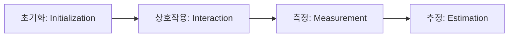

# [002].SV_양자_오류_및_양자_센서

## 1. [도입: Why] 양자 오류 및 센서의 개요

### 가. 정의
- **양자 오류(Quantum Error)**: 양자 상태가 외부 환경(노이즈)과 상호작용하여 정보를 상실하거나 잘못된 결과를 도출하는 현상
- **양자 센서(Quantum Sensor)**: 양자 중첩과 얽힘의 민감도를 활용하여 물리량(자기장, 중력 등)을 초정밀 계측하는 장치

### 나. 등장 배경 및 필요성
1. **신뢰성 확보**: 양자 컴퓨터의 대형화 시 오류 전파가 기하급수적으로 증가하므로 제어 및 수정 필수
2. **초정밀 관측 요구**: 기존 고전 센서로 측정이 불가능한 초미세 물리량 탐지를 통해 의료(MRI 정밀도), 국방(스텔스 탐지) 등 혁신 유도

## 2. [핵심: What & How] 양자 오류 처리 및 센싱 메커니즘

### 가. 양자 오류의 종류
| 종류 | 설명 | 특징 |
|---|---|---|
| **T1 양자 오류** | 에너지 이완(Relaxation)에 의한 오류 | 1에서 0으로 상태 변화 |
| **T2 양자 오류** | 위상 결잃음(Dephasing)에 의한 오류 | 양자 결맞음 상실 |
| **게이트 오류** | 양자 연산(Gate Operation) 수행 시 부정확성 | 연산 신뢰도 저하 |
| **누화 (Crosstalk)** | 인접 큐비트 간 원치 않는 상호작용 | 회로 규모 증가 시 심화 |

### 나. 양자 계측 수행 단계 (Mermaid)

## 3. [심화: Deep-dive] 양자 오류 제어 및 센서 종류

### 가. 양자 오류 처리 기법 (억제-완화-정정)
1. **오류 억제 (Suppression)**: 하드웨어 설계를 통한 노이즈 차단 (동적 디커플링, 피드백 제어)
2. **오류 완화 (Mitigation)**: 소프트웨어적 보정 (확률적 오류 제거, 제로 노이즈 외삽)
3. **오류 정정 (Correction)**: 다수의 물리적 큐비트를 하나의 **논리적 큐비트**로 묶어 표면 코드(Surface Code) 적용

### 나. 양자 센서의 유형 및 특징
| 센서 종류 | 측정 물리량 | 주요 활용 분야 |
|---|---|---|
| **양자 중력 센서** | 중력 가속도 및 밀도 | 지하 자원 탐사, 싱크홀 감지 |
| **양자 항법 센서** | 정밀 가속도 및 회전 | GPS 음영 지역(잠수함 등) 초정밀 항법 |
| **양자 자기장 센서** | 뇌/심장 등 초미세 자기장 | 비침습적 정밀 의료 진단 |
| **양자 광학 센서** | 광자의 위상 및 수 | 양자 스텔스 레이더, 통신 보안 |

## 4. [결론: Effect & Insight] 기술사적 제언

### 가. 기술적 전환점: 논리적 큐비트 시대로의 이행
- 현재의 물리적 큐비트 수천 개를 오류 정정 코드를 통해 신뢰할 수 있는 **논리적 큐비트**로 전환하는 기술이 상용화의 핵심 지표가 될 것임

### 나. 산업적 거버넌스 및 제언
- 양자 센서는 단기적으로 군사 및 정밀 의료 분야에서 실질적 부가가치를 창출할 것이므로, 원천 기술과 응용 기기 국산화(K-양자 전략)를 연계한 산업 생태계 강화가 시급함

## 5. 검증 체크리스트 (PE-Audit)

| # | 검증 항목 | 기준 | 판정 |
|---|---|---|---|
| 1 | **최신성·정확성** | T1/T2 오류 및 계측 4단계, 센서 유형 반영 | ✅ |
| 2 | **키워드 적정성** | 논리적 큐비트, 표면 코드, 결잃음, 초기화/측정 등 | ✅ |
| 3 | **시각화 품질** | 양자 센싱의 4단계를 흐름도로 명확히 표현 | ✅ |
| 4 | **논리적 일관성** | 오류 해결책과 센싱 기술의 정밀도 향상 연결 | ✅ |
| 5 | **차별화 요소** | K-양자 전략 및 산업 생태계 강화 제언 포함 | ✅ |
