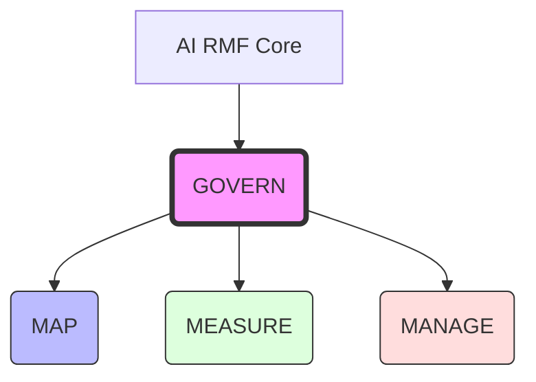

Parent: [[08.AI/GEMINI.MD]]

# 1. AI RMF(Risk Management Framework)의 개요 및 배경

## 가. 정의
- AI 시스템의 개발, 배포, 사용에 따른 **위험을 식별, 평가, 관리**하기 위해 미국 국립표준기술연구소(NIST)에서 제시한 **자발적인 관리 프레임워크**
- 인공지능 기술의 신뢰성(Trustworthiness) 확보와 부정적 사회 파급 효과 최소화를 목표로 함

## 나. 등장 배경 및 필요성
- **복잡성 증가**: AI 시스템의 블랙박스 특성 및 비결정론적 동작으로 인한 위험 제어 난해
- **사회적 부작용**: 편향성(Bias), 불투명성, 프라이버시 침해 등 사회적 신뢰 저해 요소 발생
- **글로벌 규제 대응**: EU AI Act 등 글로벌 규제 강화에 따른 표준 가이드라인 요구

# 2. AI RMF의 4가지 핵심 구조 (Core Functions)

## 가. 개념도

## 나. 핵심 구성 요소 [두음: 거맵메매]
| 기능 | 주요 내용 | 핵심 활동 |
|---|---|---|
| **GOVERN (거버넌스)** | 위험 관리 문화 및 조직 역량 강화 | 정책 수립, 책임 할당, 인력 양성 |
| **MAP (매핑)** | 맥락(Context) 분석 및 위험 식별 | 시스템 경계 설정, 잠재적 영향 파악 |
| **MEASURE (측정)** | 위험의 정량적/정성적 분석 및 평가 | 신뢰성 특성 분석, 지표 측정, 테스트 |
| **MANAGE (관리)** | 위험 대응 및 우선순위 결정 | 위험 수용/회피/완화 전략 적용, 지속 모니터링 |

# 3. AI RMF의 7가지 신뢰 가능한 특성 (Trustworthy Characteristics)

| 특성 | 설명 | 비고 |
|---|---|---|
| **Safe (안전성)** | 위험한 환경에서 오동작 방지 및 생명/재산 보호 | 신뢰성의 기초 |
| **Secure & Resilient (보안성/회복력)** | 적대적 공격 방어 및 시스템 오류 시 복원 능력 | 모델/데이터 보안 |
| **Explainable & Interpretable (설명/해석 가능성)** | 작동 원리 설명 및 결과에 대한 논리적 이해 제공 | XAI 연계 |
| **Privacy-Enhanced (프라이버시 강화)** | 데이터 보호 및 익명화 보장 | 가명정보 처리 |
| **Fair (공정성)** | 편향 제거 및 특정 집단에 대한 차별 방지 | 데이터 편향 관리 |
| **Accountable & Transparent (책임성/투명성)** | 책임 소재 명확화 및 개발/운용 과정 공개 | 로깅 및 감사 |
| **Valid & Reliable (유효성/신뢰성)** | 의도한 대로 동작하고 결과가 일관성 있게 출력됨 | 성능 검증 |

# 4. 기술사적 제언 및 실무 적용 방안

## 가. 실무 도입 시 고려사항
- **Context 중심**: 산업별(금융, 의료 등) 특성에 따른 위험 임계치(Threshold) 설정 필요
- **Lifecycle 통합**: 설계-개발-테스트-운영 전 단계에 RMF Core를 내재화하는 **Risk-by-Design** 전략 필요

## 나. 향후 발전 방향
- **AI 규제 대응**: ISO/IEC 42001(AI 경영시스템)과의 연계를 통한 표준 준수 증명
- **자동화 도구 활용**: AI 위험 측정 및 모니터링을 자동화하는 MLOps/LLMOps 프레임워크와 결합

> [!tip] **기술사 인사이트**
> AI RMF는 단순히 기술적 대응을 넘어 **조직의 거버넌스(GOVERN)**를 최우선 가치로 둡니다. 이는 AI 위험 관리가 기술적 패치보다 **전략적 의사결정**의 영역임을 시사합니다.

## Related Notes
- [[002.ISO_IEC_42001_2023.md]]
- [[003.Prompt_Injection.md]]
- [[004.Model_Inversion_Attack.md]]
