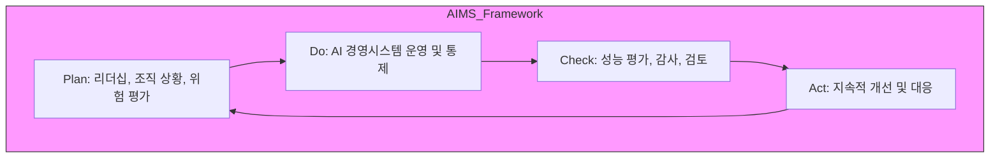

Parent: [[08.AI/GEMINI.MD]]

# 1. ISO/IEC 42001:2023의 개요 및 배경

## 가. 정의
- 조직이 AI 시스템을 **책임감 있게 개발, 제공 및 사용**하기 위해 수립해야 하는 **인공지능 경영시스템(AIMS)**의 요구사항을 규정한 **국제 표준**
- ISO 9001, ISO 27001과 같은 **HLS(High Level Structure)** 기반의 관리 체계를 AI 도메인에 적용

## 나. 등장 배경 및 필요성
- **AI 신뢰성 요구**: AI의 불투명성, 편향성 문제를 해결하기 위한 조직적 관리 체계 필요
- **글로벌 규제 대응**: EU AI Act 등 각국 규제 준수(Compliance) 입증 수단으로 활용
- **비즈니스 경쟁력**: AI 도입 시 발생할 수 있는 위험을 체계적으로 관리하여 지속 가능한 성장 도모

# 2. ISO/IEC 42001의 아키텍처 및 핵심 메커니즘

## 가. 개념도 (PDCA 사이클 적용)

## 나. 핵심 구성 요소 (Annex A 통제 항목 중심)
| 영역 | 주요 통제 항목 | 핵심 내용 |
|---|---|---|
| **AI 정책** | 조직의 AI 전략 및 목표 | 리더십의 의지 및 AI 활용 원칙 수립 |
| **자원 관리** | 데이터, 컴퓨팅, 인적 자원 | AI 개발/운영을 위한 필수 자원 확보 및 통제 |
| **위험 관리** | AI 위험 식별 및 평가 | ISO 31000 연계, AI 특화 위험 관리 프로세스 |
| **시스템 수명주기** | 설계, 개발, 배포, 유지보수 | AI 수명주기 전반의 품질 및 안전성 확보 |
| **투명성 및 설명력** | AI 시스템 작동 과정 문서화 | 사용자 정보 제공 및 외부 감사 대응성 |

# 3. ISO/IEC 42001의 상세 구조 및 비교

## 가. 주요 조항 (Clause 4~10)
1.  **조직 상황 (Clause 4)**: 이해관계자 니즈 파악, AIMS 범위 설정
2.  **리더십 (Clause 5)**: AI 정책 수립, 역할 및 책임 할당
3.  **기획 (Clause 6)**: 위험 및 기회 식별, AI 목표 설정
4.  **지원 (Clause 7)**: 자원 확보, 역량 강화, 문서화
5.  **운용 (Clause 8)**: 프로세스 통제, AI 위험 평가 및 처리
6.  **성능 평가 (Clause 9)**: 모니터링, 내부 감사, 경영 검토
7.  **개선 (Clause 10)**: 부적합 시정, 지속적 개선 활동

## 나. 타 관리 체계와의 비교
| 비교 항목 | ISO/IEC 27001 (ISMS) | ISO/IEC 42001 (AIMS) |
|---|---|---|
| **핵심 목적** | 정보 자산의 기밀성, 무결성, 가용성 | AI 시스템의 신뢰성, 안전성, 책임성 |
| **주요 대상** | 일반적인 정보 시스템 | 인공지능 모델 및 데이터 중심 시스템 |
| **위험 요소** | 해킹, 정보 유출, 물리적 보안 | 모델 편향, 할루시네이션(Hallucination), 윤리성 |
| **관리 기법** | 접근 제어, 암호화 등 | 데이터 정제, 성능 지표 관리, 설명 가능성(XAI) |

# 4. 기술사적 제언 및 실무 적용 방안

## 가. 실무 도입 시 고려사항
- **데이터 거버넌스 통합**: AI 모델의 품질은 데이터에 좌우되므로 ISO 8000(데이터 품질) 등과 연계 필요
- **조직적 역량**: AI 전문가뿐만 아니라 법률, 윤리 전문가를 포함한 **Cross-functional Team** 구성 필수

## 나. 향후 발전 방향
- **공급망 관리**: AI 오픈소스 라이브러리 및 클라우드(SaaS) 기반 AI 서비스의 위험 관리 확대
- **인증 활성화**: ESG 경영 및 공공 부문 AI 도입 시 필수 요건으로 자리 잡을 것으로 전망

> [!tip] **기술사 인사이트**
> ISO/IEC 42001은 단순한 기술 표준이 아닌 **조직의 경영 철학**을 담은 표준입니다. **NIST AI RMF**가 위험 관리 프레임워크라면, **ISO 42001**은 이를 조직 체계로 내재화한 **인증 모델**입니다.

## Related Notes
- [[001.AI_RMF.md]]
- [[069.MG_IT_嫄곕
                    
                     .md]]
- [[015.Risk_Assessment.md]]
