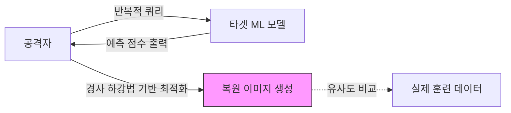

Parent: [[08.AI/GEMINI.MD]]

# 1. 모델 전도 공격의 개요 및 배경

## 가. 정의
- 기계 학습(ML) 모델의 예측값(Confidence Score)을 분석하여 모델 학습에 사용된 **훈련 데이터의 민감한 정보(얼굴 이미지 등)를 복원**해내는 공격 기법
- 모델의 출력 정보를 거꾸로 추적하여 입력 데이터의 특징을 추출하는 **프라이버시 침해 공격**

## 나. 등장 배경 및 필요성
- **데이터 프라이버시 강화**: 개인정보보호법(GDPR, 국내 개인정보보호법) 준수 요구 증대
- **모델 공개의 역설**: API 형태로 공개된 모델이 예기치 않게 훈련 데이터의 지식을 외부로 유출할 위험성
- **AI 신뢰성**: 모델 자체의 성능뿐만 아니라 훈련 데이터의 보안성 확보가 필수적임

# 2. 모델 전도 공격의 아키텍처 및 핵심 메커니즘

## 가. 개념도

## 나. 핵심 메커니즘
| 단계 | 설명 | 기술적 요소 |
|---|---|---|
| **1. 쿼리 수행** | 타겟 모델에 임의의 데이터를 입력하고 결과값을 수집 | API 호출, Confidence Score 획득 |
| **2. 손실 함수 정의** | 복원하려는 클래스(예: 특정 인물)의 예측값이 최대가 되도록 손실 함수 설계 | MSE, Cross-Entropy |
| **3. 역전파 최적화** | 가중치가 아닌 **입력 이미지 값**을 업데이트하여 모델이 확신하는 이미지로 수렴 | Gradient Descent, Optimizer |
| **4. 정보 추출** | 최종 수렴된 이미지가 훈련 데이터의 특징을 나타냄 | 시각화, 특징점 비교 |

# 3. 상세 분석 및 방어 전략

## 가. 멤버십 추론 공격(Membership Inference)과의 비교
| 비교 항목 | 모델 전도 공격 (Inversion) | 멤버십 추론 공격 (Inference) |
|---|---|---|
| **목적** | 훈련 데이터 자체의 **복원** 및 재구성 | 특정 데이터가 훈련에 **사용되었는지** 여부 판별 |
| **결과물** | 얼굴 이미지, 텍스트 원문 등 | Yes / No (사용 여부) |
| **난이도** | 상대적으로 높음 (정밀한 최적화 필요) | 상대적으로 낮음 (통계적 분포 차이 이용) |

## 나. 방어 전략
1.  **차분 프라이버시 (Differential Privacy)**: 훈련 시 데이터나 그래디언트에 노이즈를 추가하여 개별 데이터의 기여도를 모호하게 만듦
2.  **Confidence Score 제한**: 소수점 자릿수를 줄이거나 가장 높은 확률의 클래스만 반환(Argmax)하여 정보 노출 최소화
3.  **데이터 증강 (Data Augmentation)**: 학습 데이터를 다양하게 변형하여 모델이 특정 데이터에 과적합(Overfitting)되지 않도록 방지

# 4. 기술사적 제언 및 실무 적용 방안

## 가. 실무 도입 시 고려사항
- **성능과 보안의 트레이드오프**: 차분 프라이버시 적용 시 모델의 예측 성능이 저하될 수 있으므로 적절한 **프라이버시 예산(Epsilon)** 설정 필요
- **API 거버넌스**: 외부 노출 API의 경우 초당 호출 횟수 제한(Rate Limiting)을 통해 반복적인 쿼리 공격 차단

## 나. 최신 트렌드와 발전 방향
- **Federated Learning 연계**: 연합 학습 과정에서도 전도 공격을 통해 타 참여자의 데이터가 유출될 수 있으므로 보안 연산(MPC) 기술과 결합 연구 활발
- **법적 대응**: AI 모델 내에 학습 데이터의 특징이 남아 있는 경우 이를 '개인정보의 처리'로 볼 것인지에 대한 법적 쟁점 지속

> [!tip] **기술사 인사이트**
> 모델 전도 공격은 **'모델은 데이터를 기억한다'**는 사실을 증명합니다. 인공지능이 민감한 개인정보(의료, 금융 등)를 다룬다면, 모델 배포 전 반드시 **Red Teaming**을 통해 데이터 유출 가능성을 검증해야 합니다.

## Related Notes
- [[001.AI_RMF.md]]
- [[003.Prompt_Injection.md]]
- [[015.Risk_Assessment.md]]
- [[011.SE_댁
                      깆_PQC.md]]
