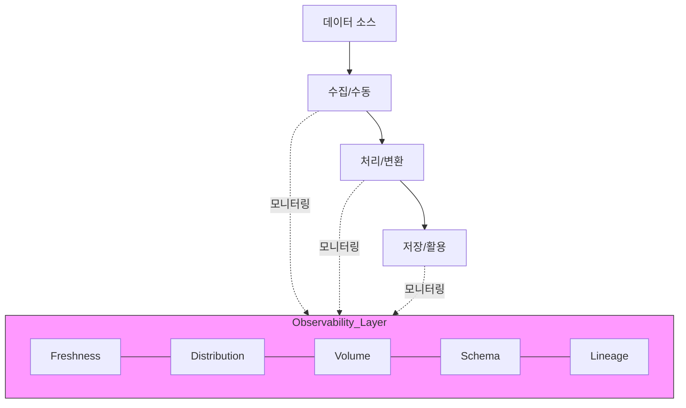

Parent: [[10.DB/GEMINI.MD]]

# 1. 데이터 관측가능성의 개요 및 배경

## 가. 정의
- 데이터 수명주기 전반에 걸쳐 데이터의 상태를 모니터링하고, 발생한 문제의 근본 원인을 식별하며, 데이터 품질 및 흐름을 자동으로 진단하는 **지능형 모니터링 체계**
- "데이터가 왜 잘못되었는가?"에 대한 답을 실시간으로 제공하는 능력

## 나. 등장 배경 및 필요성
- **데이터 파이프라인의 복잡화**: MSA, 클라우드 도입으로 인한 데이터 이동 및 변환 단계 급증
- **Data Downtime 증가**: 데이터 오류로 인한 비즈니스 중단 및 의사결정 지연 문제 심화
- **전통적 DQ의 한계**: 정적인 룰(Rule) 기반 품질 관리로는 실시간 변동 대응 불가

# 2. 데이터 관측가능성의 5가지 핵심 기둥 (5 Pillars)

## 가. 아키텍처 (개념도)

## 나. 핵심 구성 요소 [두음: 신분량스리]
| 기둥 | 설명 | 주요 체크 항목 |
|---|---|---|
| **1. Freshness (최신성)** | 데이터가 주기적으로 업데이트되고 있는가? | 마지막 업데이트 시간, 배치 주기 지연 여부 |
| **2. Distribution (분포)** | 데이터 값이 예상 범위 내에 있는가? | 평균, 분산, Null 비율, 이상치(Outlier) |
| **3. Volume (물량)** | 데이터 양이 정상적으로 적재되었는가? | 테이블 행 수(Row Count), 증감 추이 |
| **4. Schema (구조)** | 테이블 구조가 예기치 않게 변경되었는가? | 컬럼 추가/삭제, 타입 변경, 이름 변경 |
| **5. Lineage (계보)** | 데이터가 어디서 와서 어디로 가는가? | 업스트림/다운스트림 관계, 영향도 분석 |

# 3. 상세 기술 및 비교 분석

## 가. 상세 메커니즘
1.  **Anomaly Detection (이상 징후 탐지)**: 머신러닝을 기반으로 데이터의 통계적 패턴을 학습하여 이상 수치 탐지
2.  **자동화된 알럿 (Alerting)**: 임계치 초과 시 슬랙(Slack), 이메일 등으로 담당자에게 즉시 통보
3.  **Root Cause Analysis (RCA)**: 데이터 리니지를 분석하여 오류가 시작된 지점을 추적

## 나. 전통적 품질관리(DQ)와의 비교
| 비교 항목 | 전통적 데이터 품질관리 (DQ) | 데이터 관측가능성 (Data Observability) |
|---|---|---|
| **중점** | 데이터 값의 정확성 (정적) | 시스템/파이프라인의 건강 상태 (동적) |
| **수행 방식** | 정의된 룰(Rule) 기반 체크 | ML 기반 패턴 분석 및 지능형 탐지 |
| **시점** | 사후 검증 중심 | 실시간 모니터링 및 선제적 대응 |
| **범위** | 데이터 테이블 중심 | 데이터 리니지 및 파이프라인 전체 |

# 4. 기술사적 제언 및 실무 적용 방안

## 가. 실무 도입 시 고려사항
- **도구 선정**: 오픈소스(Great Expectations, Soda) 또는 상용(Monte Carlo, Acceldata) 도구의 특징 비교
- **Data Ops 연계**: 데이터 개발 및 운영 프로세스에 관측 자동화를 내재화하여 **Data-Self-Healing** 구현

## 나. 향후 발전 방향
- **AI-Native Observability**: LLM을 활용하여 데이터 스키마 변경 시 자동으로 쿼리를 수정하거나 문제 원인을 자연어로 설명
- **FinOps 연계**: 데이터 처리량과 성능 관측을 통해 클라우드 비용 최적화와 결합

> [!tip] **기술사 인사이트**
> 데이터 관측가능성은 **'데이터 품질'**을 관리하는 것이 아니라 **'데이터 신뢰'**를 관리하는 것입니다. 파이프라인이 복잡해질수록 **리니지(Lineage)** 기반의 영향도 분석 능력이 관측가능성의 핵심 차별화 요소가 됩니다.

## Related Notes
- [[075.MG_데이터_경제.md]]
- [[020.폴리글랏_퍼시스턴스(Polyglot_Persistence).md]]
- [[002.AR_MA_Models.md]] (이상 탐지 연계)
