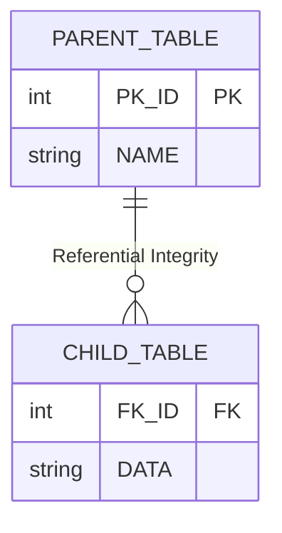

Parent: [[10.DB/GEMINI.MD]]

# 1. 참조 무결성의 개요 및 배경

## 가. 정의
- 관계형 데이터베이스(RDBMS)에서 **외래키(Foreign Key, FK)**가 참조하는 **기본키(Primary Key, PK)**의 값은 반드시 존재해야 하며, 두 릴레이션 간의 데이터 일관성이 유지되어야 한다는 **데이터 무결성 제약조건**
- 자식 릴레이션의 외래키 값은 부모 릴레이션의 기본키 값이거나 **NULL**이어야 함

## 나. 등장 배경 및 필요성
- **데이터 일관성(Consistency)**: 부모 없는 자식 데이터(Orphan Data) 발생 방지
- **데이터 신뢰성**: 테이블 간의 유효한 관계 보장을 통한 정확한 데이터 추출
- **운영 편의성**: 데이터 변경(Update) 및 삭제(Delete) 시 연쇄 작용 정의를 통한 수동 관리 최소화

# 2. 참조 무결성의 핵심 메커니즘 및 옵션

## 가. 개념도

## 나. 핵심 제약조건 옵션 [두음: 제연널기]
| 옵션 | 설명 | 동작 방식 |
|---|---|---|
| **RESTRICT (제한)** | 변경/삭제를 금지 | 부모 데이터 삭제 시 자식 데이터가 있으면 오류 발생 |
| **CASCADE (연쇄)** | 부모의 변경을 자식에게 전이 | 부모 데이터 삭제 시 관련 자식 데이터도 자동 삭제 |
| **SET NULL (널 설정)** | 자식의 FK를 NULL로 변경 | 부모 데이터 삭제 시 자식 데이터의 FK를 NULL로 설정 |
| **SET DEFAULT (기본값 설정)** | 자식의 FK를 기본값으로 변경 | 부모 데이터 삭제 시 자식 데이터의 FK를 미리 지정한 값으로 설정 |

# 3. 상세 동작 및 비교 분석

## 가. 입력/수정/삭제 시 제약
1.  **입력 (Insert)**: 자식 테이블에 데이터를 넣을 때, FK 값이 부모 테이블의 PK에 없으면 입력 거부
2.  **수정 (Update)**: 부모의 PK 수정 시 자식의 FK를 어떻게 처리할지 옵션(CASCADE 등)에 따름
3.  **삭제 (Delete)**: 부모 데이터 삭제 시 자식 데이터 존재 여부에 따라 제약 발생

## 나. 데이터 무결성 종류 비교
| 구분 | 내용 | 주요 제약 |
|---|---|---|
| **개체 무결성** | 기본키(PK)는 중복될 수 없고 NULL일 수 없음 | PRIMARY KEY |
| **참조 무결성** | 외래키(FK)는 참조하는 PK와 일치하거나 NULL이어야 함 | FOREIGN KEY |
| **도메인 무결성** | 특정 속성값은 정의된 도메인(범위) 내에 있어야 함 | CHECK, NOT NULL |
| **사용자 무결성** | 비즈니스 로직에 따른 사용자 정의 제약 | Trigger, Application Logic |

# 4. 기술사적 제언 및 실무 적용 방안

## 가. 실무 도입 시 고려사항
- **성능 이슈**: 대량 데이터 삭제 시 `CASCADE` 옵션은 연쇄적인 락(Lock) 발생 및 성능 저하 유발 가능
- **비정규화 설계**: 성능 향상을 위해 의도적으로 참조 무결성을 애플리케이션 레벨에서 관리하고 DB 제약은 제거하는 경우 발생

## 나. 최신 트렌드와 발전 방향
- **분산 데이터베이스**: NoSQL이나 분산 DB 환경에서는 참조 무결성을 DB 단에서 강제하기 어려우므로 **최종 일관성(Eventual Consistency)** 모델 채택
- **데이터 관측가능성**: DB 제약이 없는 환경에서도 리니지(Lineage) 분석을 통해 논리적 참조 무결성을 실시간으로 감시

> [!tip] **기술사 인사이트**
> 참조 무결성은 RDBMS의 **핵심 가치인 데이터 정합성**을 지키는 최후의 보루입니다. 하지만 **마이크로서비스 아키텍처(MSA)** 환경에서는 서비스 간 DB가 분리되므로, 참조 무결성을 DB 단이 아닌 **Saga 패턴** 등을 통해 보상 트랜잭션으로 해결해야 합니다.

## Related Notes
- [[015.사가_패턴(Saga_Pattern).md]]
- [[018.MSA_트랜잭션_관리.md]]
- [[001.Data_Observability.md]]
