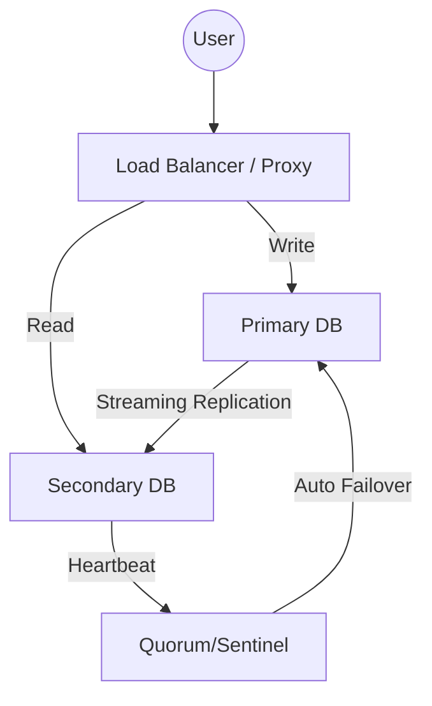

Parent: [[10.DB/GEMINI.MD]]

# 1. 오픈소스 DBMS 전환의 개요 및 배경

## 가. 정의
- 특정 벤더의 상용 DBMS(Oracle, SQL Server 등)에서 라이선스 비용이 없는 **오픈소스 DBMS(PostgreSQL, MySQL, MariaDB 등)**로 데이터와 시스템을 이전하는 활동
- 비용 절감과 기술적 유연성 확보를 목적으로 하는 **데이터베이스 현대화(Modernization)** 전략

## 나. 오픈소스 DBMS 전환 배경 [두음: 비용종클]
- **TCO 절감 (비용)**: 고액의 초기 라이선스 및 유지보수 비용(Maintenance) 부담 급증 해결
- **벤더 종속성 탈피 (종속)**: 특정 벤더의 정책 변화나 기술적 제약에서 벗어나 자유로운 인프라 구성 지향
- **클라우드 네이티브 대응 (클라우드)**: 클라우드 환경(AWS, Azure 등)과의 높은 호환성 및 오토스케일링 유리
- **기술 생태계 확장 (생태계)**: 거대한 커뮤니티를 통한 신속한 기능 업데이트 및 풍부한 오픈소스 에코시스템 활용

# 2. 오픈소스 DBMS 전환 시 검토해야 할 제약사항

| 구분 | 제약사항 및 고려사항 | 상세 내용 |
|---|---|---|
| **기능적 제약** | **SQL 호환성** | 비표준 SQL(Oracle-specific syntax) 및 스토어드 프로시저 전환 복잡도 |
| | **데이터 타입** | DBMS 간 지원하는 데이터 타입의 차이로 인한 정밀도(Precision) 유실 가능성 |
| **성능/확장성** | **대량 처리 성능** | 대규모 트랜잭션 환경에서의 안정성 및 복잡한 Join 연산 처리 능력 검증 |
| | **옵티마이저 차이** | 실행 계획(Execution Plan) 생성 방식 차이로 인한 성능 저하(Performance Regression) |
| **비기능적 제약** | **보안 및 규제** | 암호화(TDE), 접근 제어, 감사(Audit) 기능의 상용 수준 구현 여부 |
| | **기술 지원** | 장애 발생 시 즉각적인 벤더 지원 부재에 따른 내부 기술 역량 확보 필요성 |
| **운영 관리** | **백업 및 복구** | Point-in-Time Recovery(PITR) 및 관리 도구(GUI)의 성숙도 차이 |

# 3. 오픈소스 DBMS 전환 시 단계별 마이그레이션 절차

## 가. 개념도

## 나. 단계별 세부 절차 [두음: 분설변이검전]
| 단계 | 주요 활동 | 핵심 도구/기법 |
|---|---|---|
| **1. 현황 분석** | 기존 시스템 복잡도, 오브젝트(Trigger, Proc) 수 파악 | DBMS Profiling 도구 |
| **2. 대상 선정/설계** | 전환 난이도별 우선순위 산정, 인프라(On-prem/Cloud) 설계 | Migration Matrix |
| **3. 스키마 변환** | 테이블 구조, 인덱스, 프로시저 코드 변환 및 최적화 | ora2pg, AWS SCT |
| **4. 데이터 이관** | 초기 적재(Bulk Load) 및 증분 데이터 동기화(CDC) | Data Pump, DMS, CDC |
| **5. 검증 및 테스트** | SQL 결과 정합성, 성능 테스트, 애플리케이션 코드 수정 | SQL Replay, JMeter |
| **6. 전환(Cut-over)** | 최종 동기화 확인 후 시스템 오픈, 안정화 모니터링 | Parallel Run, Blue-Green |

# 4. 신뢰성 확보를 위한 고가용성(HA) 아키텍처 구성 방안

## 가. 구성 방식 비교 [두음: 공복프]
| 구성 방식 | 아키텍처 구조 | 특징 및 장단점 |
|---|---|---|
| **Shared Disk 방식** | **Active-Standby** (공유 스토리지) | 장애 시 스토리지 전환, 데이터 정합성 우수 / 스토리지 단일 장애점(SPOF) |
| **Replication 방식** | **Active-Standby** (데이터 복제) | Streaming Replication 활용, 원격지 구성 가능 / 복제 지연(Lag) 발생 가능 |
| **Proxy/LB 방식** | **Load Balancer + DB Cluster** | Read-Write 분산 처리, 확장성 우수 / 아키텍처 복잡도 증가 |

## 나. 권장 HA 아키텍처 도식 (Streaming Replication 기반)

- **주요 메커니즘**: **Streaming Replication**(실시간 로그 복제), **Automatic Failover**(장애 감지 및 자동 승격), **Load Balancing**(읽기 부하 분산)

# 5. 기술사적 제언 및 실무 적용 방안

- **자동화 도구 활용**: 수작업으로 인한 오류를 줄이기 위해 **Schema Conversion Tool**과 **CDC(Change Data Capture)** 기술을 적극 도입해야 함
- **부분적 전환 전략**: 전체 시스템 일괄 전환(Big-bang)보다는 중요도가 낮은 단위 업무부터 점진적으로 전환하여 리스크를 분산(Phased Approach)하는 것이 바람직함

> [!tip] **기술사 인사이트**
> 오픈소스 DBMS 전환은 단순한 '비용 절감'을 넘어 **'클라우드 네이티브로의 여정'**입니다. 성공적인 전환을 위해서는 기술적 마이그레이션뿐만 아니라, **DBRE(Database Reliability Engineering)** 관점의 운영 역량 내재화가 필수적입니다.

## Related Notes
- [[001.Data_Observability.md]]
- [[002.Referential_Integrity.md]]
- [[018.MSA_트랜잭션_관리.md]]
