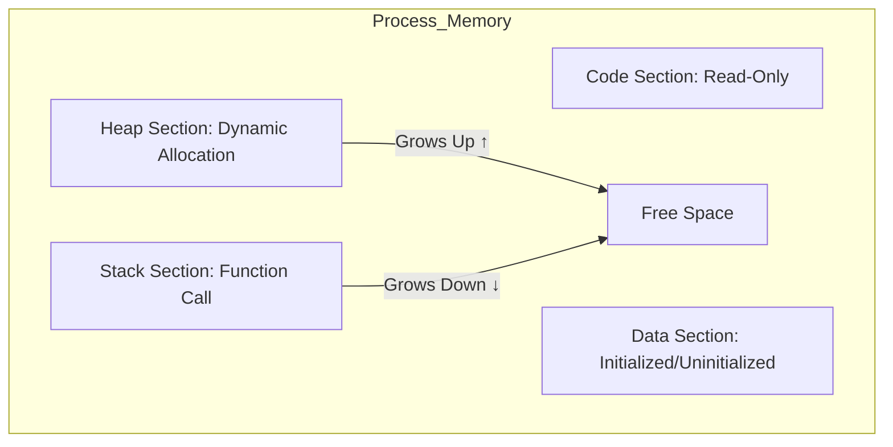

Parent: [[11.OS/GEMINI.MD]]

# 1. 프로세스 메모리 구조의 개요

## 가. 정의
- 운영체제가 실행 중인 프로그램(프로세스)에게 할당하는 가상 메모리 공간으로, 용도에 따라 **코드(Code), 데이터(Data), 힙(Heap), 스택(Stack)**의 4가지 주요 영역으로 구분하여 관리함

## 나. 메모리 할당의 목적
- **효율성**: 데이터 성격에 따른 분리 저장을 통해 메모리 활용도 극대화
- **안전성**: 영역별 접근 권한(Read, Write, Execute) 부여를 통한 보호
- **공유**: 동일 프로그램의 여러 프로세스가 코드 영역을 공유하여 자원 절약

# 2. 프로세스 메모리의 4가지 주요 영역

## 가. 개념도

## 나. 영역별 특징 및 역할 [두음: 코데힙스]
| 영역 | 역할 | 특징 |
|---|---|---|
| **Code (Text)** | 실행할 프로그램의 기계어 코드 저장 | **Read-Only** (수정 불가), 상주 메모리 |
| **Data** | 전역 변수(Global), 정적 변수(Static) 저장 | **Read-Write**, 프로그램 시작 시 할당, 종료 시 해제 |
| **Heap** | 사용자(개발자)가 직접 할당하는 공간 | **동적 할당**, 런타임 결정, 관리 실패 시 **Memory Leak** 발생 |
| **Stack** | 함수 호출 시 지역 변수, 매개 변수 저장 | **컴파일 타임** 결정, 후입선출(LIFO), 자동 해제 |

# 3. 상세 동작 메커니즘 및 영역 간 상호작용

## 가. 데이터 영역의 세분화 (BSS vs Data)
- **Data (Initialized)**: 초기값이 있는 전역 변수 저장
- **BSS (Block Started by Symbol)**: 초기값이 없는 전역 변수 저장 (메모리 절약을 위해 0으로 초기화됨)

## 나. 힙(Heap)과 스택(Stack)의 충돌 방지
- **Heap**: 메모리 낮은 주소에서 높은 주소 방향으로 할당 (Upward)
- **Stack**: 메모리 높은 주소에서 낮은 주소 방향으로 할당 (Downward)
- 두 영역 사이의 자유 공간을 공유하며, 서로의 영역을 침범할 경우 **Heap Overflow** 또는 **Stack Overflow** 발생

## 다. 영역별 할당 시점 비교
| 항목 | 코드/데이터 영역 | 힙 영역 | 스택 영역 |
|---|---|---|---|
| **할당 시점** | 컴파일 타임 (정적) | 런타임 (동적) | 컴파일 타임/런타임 (정적/동적) |
| **관리 주체** | OS (Loader) | 개발자 (malloc/free) | OS (CPU/Compiler) |

# 4. 기술사적 제언 및 실무 적용 방안

## 가. 실무 관리 포인트
- **메모리 누수(Leak)**: 힙 영역 할당 후 해제하지 않을 경우 시스템 가용성 저하. `Valgrind` 등의 도구로 추적 필요
- **보안 위협(Buffer Overflow)**: 스택 영역의 경계를 넘는 데이터 입력으로 복귀 주소(Return Address)를 변조하는 공격 주의 (ASLR, NX Bit 적용)

## 나. 최신 트렌드
- **Garbage Collection (GC)**: Java, Python 등 현대 언어는 힙 영역을 자동으로 관리하여 개발자 부담을 줄이나, GC 수행 시 **Stop-the-world** 발생 가능성 고려
- **Zero-Copy**: 데이터 이동 시 커널과 유저 메모리 영역 간의 복사를 최소화하여 성능 향상 도모

> [!tip] **기술사 인사이트**
> 프로세스 메모리 구조는 **'정적 자산(Code/Data)'**과 **'동적 자원(Heap/Stack)'**의 조화입니다. 특히 **재진입 가능성(Reentrancy)**을 확보하기 위해 코드 영역을 읽기 전용으로 격리하는 설계 원리를 이해하는 것이 중요합니다.

## Related Notes
- [[001.Banker_Algorithm.md]]
- [[128.대┛_肄(Clean_Code).md]] (메모리 관리 관점)
- [[143.湲곗_遺梨(Technical_Debt).md]]
